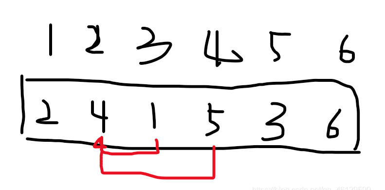

## 题面
[https://ac.nowcoder.com/acm/contest/6112/E](https://ac.nowcoder.com/acm/contest/6112/E)
## 题意
求在一个序列中有几个【L,R】满足a[l]是这个序列的次小值，a[r]是这个区间的次大值
## 思路
1. 因为左右两边的性质相关相反，所以我们考虑把一个端点固定下来以后，找另一端的约束区间
2. 首先我们把左端点固定下来，用左端点是次小值的这个性质，把右端点的约束区间确定下来，比如说：


如图这个区间，对于第二个数4而言，以4为左端点满足条件的区间只有【2，3】和【2，4】，以左端点为4的约束区间为【3，4】

 3. 所以这个地方我们可以运用一下差分数组的原理，把约束区间【l，r】中的【l】标记为1，【r+1】标记为-1
 4. 用树状数组来放入我们的这些标记，当跑到i这个位置的时候再以i为右端点来计算左区间的个数，然后加到ans中去

## 代码

```cpp
#include <cstdio>
#include<iostream>
#include<algorithm>
#include<cstring>
#include<string>
#include<vector>
#include<cmath>
#include<map>
#define ls k<<1
#define rs k<<1|1
using namespace std;
typedef long long ll;
typedef pair<int,int>P;
typedef unsigned long long ull;
const int maxn=1e6+100;
const int inf=1e6+2;
int n;
struct
{
    int l,r;
    int maxx,minn;
}node1[maxn<<2];
int a[maxn];
int cnt[maxn];
vector<int> pos[maxn];
int c[maxn];
int lowbit(int x)
{
	return x&(-x);
}

void update(int pos,int val)
{
	while(pos<maxn)
	{
		c[pos]+=val;
		pos+=lowbit(pos);
	}
}

int query(int pos)
{
	int ans=0;
	while(pos)
	{
		ans+=c[pos];
		pos-=lowbit(pos);
	}
	return ans;
}

void up1(int k)
{
    node1[k].maxx=max(node1[ls].maxx,node1[rs].maxx);
    node1[k].minn=min(node1[ls].minn,node1[rs].minn);
}
void build1(int k,int l,int r)
{
    node1[k].l=l;
    node1[k].r=r;
    if(l==r)
    {
        node1[k].maxx=a[l];
        node1[k].minn=a[l];
        return ;
    }
    int mid=l+r>>1;
    build1(ls,l,mid);
    build1(rs,mid+1,r);
    up1(k);
}
int query_maxx(int k,int l,int r,int val)
{
    if(l>r) return 0;
    if(node1[k].r<l||node1[k].l>r) return 0;
    if(node1[k].maxx<=val) return 0;
    if(node1[k].l==node1[k].r) return node1[k].l;
    int tmp=query_maxx(rs,l,r,val);
    if(tmp!=0) return tmp;
    else return query_maxx(ls,l,r,val);
}
int query_minn(int k,int l,int r,int val)
{
    if(l>r) return n+1;
    if(node1[k].r<l||node1[k].l>r) return n+1;
    if(node1[k].minn>=val) return n+1;
    if(node1[k].l==node1[k].r) return node1[k].l;
    int tmp=query_minn(ls,l,r,val);
    if(tmp!=n+1) return tmp;
    else return query_minn(rs,l,r,val);
}
int main()
{
    scanf("%d",&n);
    for(int i=1;i<=n;i++) scanf("%d",&a[i]);
    build1(1,1,n);
    ll ans=0;
    for(int i=1;i<=n;i++)
    {
        int l=query_minn(1,i,n,a[i]);//下边界
        int r=query_minn(1,l+1,n,a[i]);//上边界
        pos[l].push_back(i);
        pos[r].push_back(-i);
        for(int j=0;j<pos[i].size();j++)
        {
            int k=pos[i][j];
            if(k>0)
            {

                if(cnt[k]==0)
                    update(k,1);
                cnt[k]++;
            }
            else
            {
                cnt[-k]--;
                if(cnt[-k]==0)
                    update(-k,-1);
            }
        }
        r=query_maxx(1,1,i,a[i]);l=query_maxx(1,1,r-1,a[i]);
        ans+=query(r)-query(l);
    }
    printf("%lld\n",ans);
    return 0;
}

```
