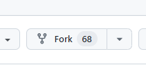
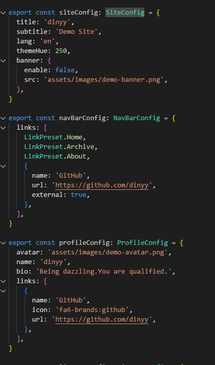

> Cover image source: [Source](https://image.civitai.com/xG1nkqKTMzGDvpLrqFT7WA/208fc754-890d-4adb-9753-2c963332675d/width=2048/01651-1456859105-(colour_1.5),girl,_Blue,yellow,green,cyan,purple,red,pink,_best,8k,UHD,masterpiece,male%20focus,%201boy,gloves,%20ponytail,%20long%20hair,.jpeg)


## 一、博客主题及其选取原因
博客最终选取了[Fuwari](https://github.com/saicaca/fuwari)该模板，选择原因是因为这个模板比较美观，改模板基于[Astro](https://astro.build/)和[Tailwind CSS](https://tailwindcss.com/),网上教程比较少，最终根据仓库中的使用教程和Astro的官方部署教程成功搭建

## 二、fork Fuwari仓库

点击仓库右上角该按钮命名成自己仓库即可

## 三、本地安装
1. git clone 刚刚fork的仓库
2. 安装pnpm： ```npm install -g pnpm```
3. 用pnpm安装相关依赖：`pnpm install` 和 `pnpm add sharp`

## 四、修改配置文件
修改`src/config.ts`比如图中的图标链接背景图片等


## 五、创建新页面
运行`pnpm new-post <filename>` 然后在`src/content/posts/`路径中修改文件
文档的详细信息如下：

### Guide
```yaml
---
title: My First Blog Post
published: 2023-09-09
description: This is the first post of my new Astro blog.
image: ./cover.jpg
tags: [Foo, Bar]
category: Front-end
draft: false
---
```

| Attribute     | Description                                                                                                                                                                                                 |
|---------------|-------------------------------------------------------------------------------------------------------------------------------------------------------------------------------------------------------------|
| `title`       | The title of the post.                                                                                                                                                                                      |
| `published`   | The date the post was published.                                                                                                                                                                            |
| `description` | A short description of the post. Displayed on index page.                                                                                                                                                   |
| `image`       | The cover image path of the post.<br/>1. Start with `http://` or `https://`: Use web image<br/>2. Start with `/`: For image in `public` dir<br/>3. With none of the prefixes: Relative to the markdown file |
| `tags`        | The tags of the post.                                                                                                                                                                                       |
| `category`    | The category of the post.                                                                                                                                                                                   |
| `draft`        | If this post is still a draft, which won't be displayed.                                                                                                                                                    |

### Where to Place the Post Files


Your post files should be placed in `src/content/posts/` directory. You can also create sub-directories to better organize your posts and assets.

```
src/content/posts/
├── post-1.md
└── post-2/
    ├── cover.png
    └── index.md
```

## 六、本地部署
在仓库根目录下运行`pnpm dev`在本地部署查看是否正确运行
运行后在`localhost:4321`页面打开查看

## 七、github部署
### 7.1在`astro.config.mjs` 中配置文件设置 `site` 和 `base` 选项
```
import { defineConfig } from 'astro/config'

export default defineConfig({
  site: 'https://astronaut.github.io',
  base: 'my-repo',
})
```
1. site
site 的值必须是以下之一：
- 基于你的用户名的以下网址：https://<username>.github.io
- 为 GitHub 组织的私有页面 自动生成的随机网址：https://<random-string>.pages.github.io/
base
2. base
可能需要为 base 设置一个值，以便 Astro 将你的仓库名称（例如 /my-repo）视为你网站的根目录。

> 注意：如果出现了以下情况，则不要设置 base 参数：
>- 你的页面是由根文件夹所提供。
>- 你的源码存储库是位于 https://github.com/<USERNAME>/<USERNAME>.github.io。

### 7.2 配置 GitHub Action
在你的项目中的 `.github/workflows/` 目录创建一个新文件 `deploy.yml`，并粘贴以下 `YAML` 配置信息
```
name: Deploy to GitHub Pages

on:
  # 每次推送到 `main` 分支时触发这个“工作流程”
  # 如果你使用了别的分支名，请按需将 `main` 替换成你的分支名
  push:
    branches: [ main ]
  # 允许你在 GitHub 上的 Actions 标签中手动触发此“工作流程”
  workflow_dispatch:

# 允许 job 克隆 repo 并创建一个 page deployment
permissions:
  contents: read
  pages: write
  id-token: write

jobs:
  build:
    runs-on: ubuntu-latest
    steps:
      - name: Checkout your repository using git
        uses: actions/checkout@v4
      - name: Install, build, and upload your site
        uses: withastro/action@v2
        # with:
          # path: . # 存储库中 Astro 项目的根位置。（可选）
          # node-version: 20 # 用于构建站点的特定 Node.js 版本，默认为 20。（可选）
          # package-manager: pnpm@latest # 应使用哪个 Node.js 包管理器来安装依赖项和构建站点。会根据存储库中的 lockfile 自动检测。（可选）

  deploy:
    needs: build
    runs-on: ubuntu-latest
    environment:
      name: github-pages
      url: ${{ steps.deployment.outputs.page_url }}
    steps:
      - name: Deploy to GitHub Pages
        id: deployment
        uses: actions/deploy-pages@v4
```
### 7.3 在仓库中进行设置
1. 在 GitHub 上，跳转到存储库的`Settings` 选项卡并找到设置的 `Pages` 部分。
2. 选择 `GitHub Actions` 作为你网站的 `Source`，然后按 `Save`。
3. 提交（commit）这个新的“工作流程文件”（workflow file）并将其推送到 GitHub。

