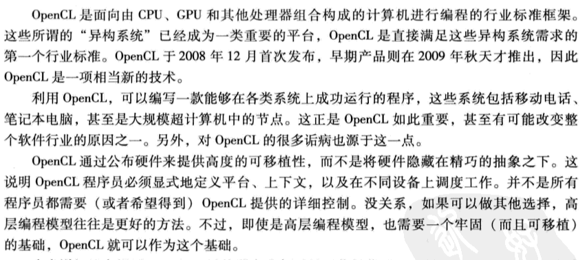
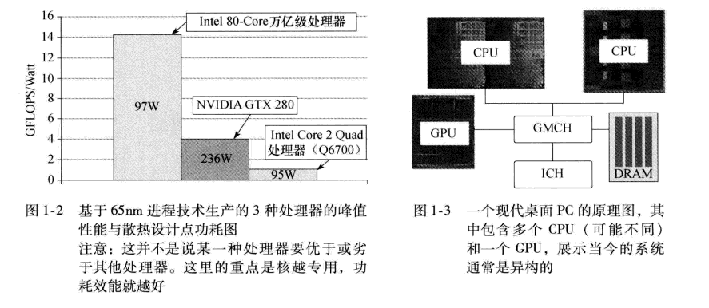
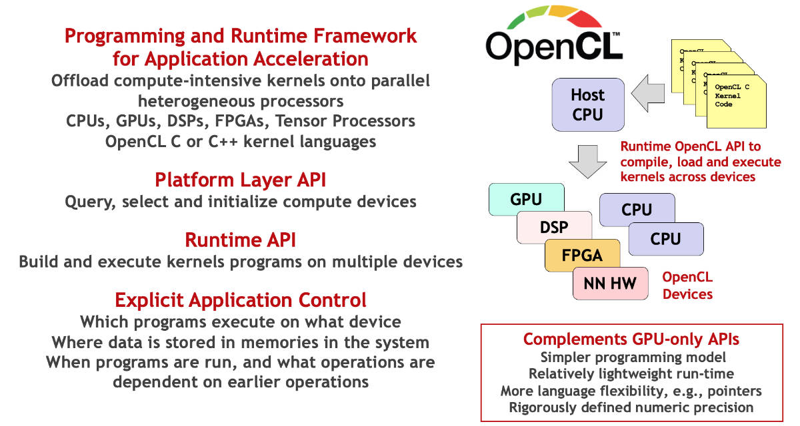
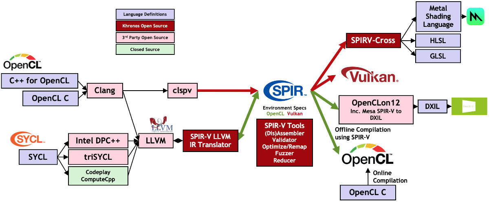
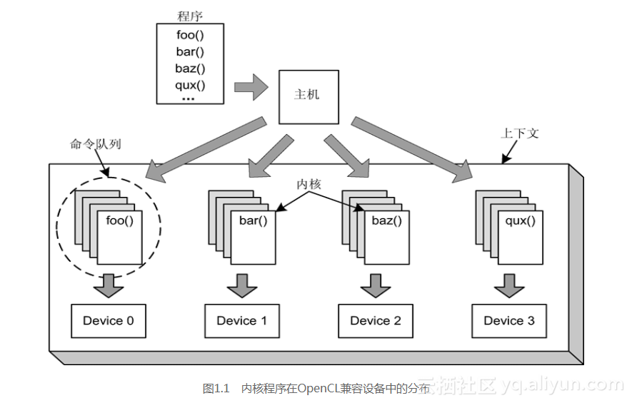
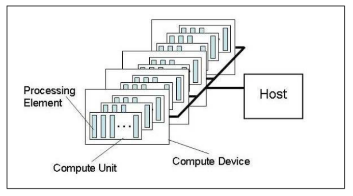
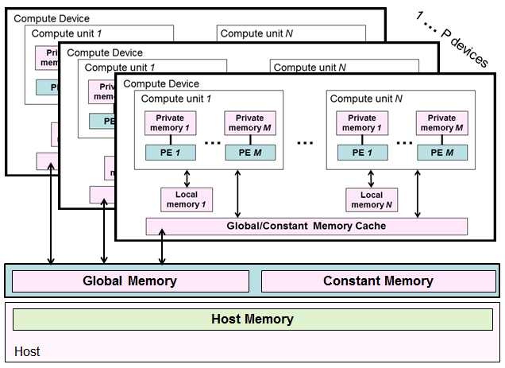
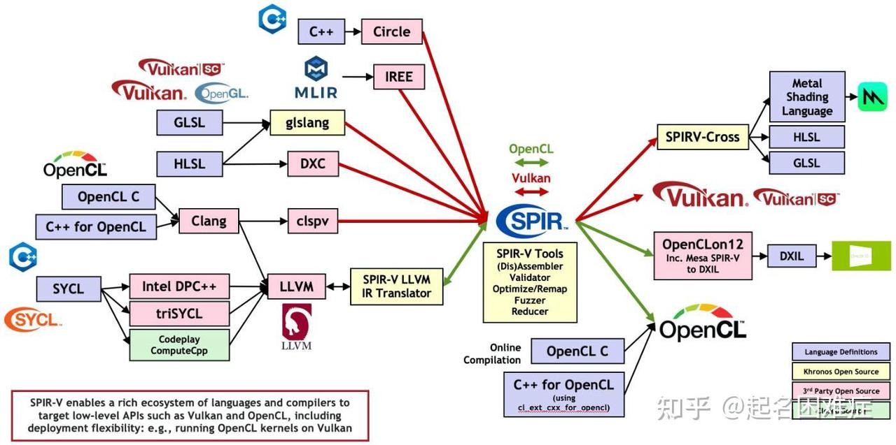

## 一、背景
OpenCL用来干嘛的？为什么要用OpenCL？

OpenCL标准只是在C和C++的基础之上，扩展定义了一些数据类型，数据结构以及函数罢了。尽管开发人员已经针对Java和Python设计了一系列的OpenCL接口库，但标准中只要求OpenCL框架提供C和C++编写的API。
OpenCL是为了实现异构编程，所谓异构编程，就是将不同厂家、不同架构的芯片放在一个统一的计算机系统中，通过软件的调度，来实现计算的一种方式。比如将x86的CPU和英伟达的GPU放在一起进行编程。
**多核的未来：异构平台**

并行计算的趋势？这些核是一样的还是不一样的？通用和专用？
结论：只要任务和处理器很好地匹配，芯片越专用，功耗效能就越好。

## 二、Overview
**用于异构系统并行编程的开放标准
OpenC（Open Computing Language）是一种开放、免费的标准，用于在超级计算机、云服务器、个人电脑、移动设备和嵌入式平台中实现各种加速器的跨平台并行编程。OpenCL显著提高了众多市场领域中各种应用程序的速度和响应能力，包括专业创意工具、科学和医疗软件、视觉处理以及神经网络训练和推理。**
OpenCL通过将应用程序中最计算密集的代码卸载到加速处理器或设备上，加速了应用程序的运行。

OpenCL与Khronos的其他并行加速标准的关系
OpenCL为行业提供了加速应用程序、库和引擎的最接近底层硬件的执行层，并为编译器提供了代码生成的目标。与"仅GPU"的API（例如Vulkan）不同，OpenCL支持多种加速器的使用，包括多核CPU、GPU、DSP、FPGA以及专用硬件，比如推理引擎。

OpenCL的部署灵活性
随着平台和设备的行业格局变得越来越复杂，工具正在不断发展，以使OpenCL应用程序能够部署到没有可用原生OpenCL驱动程序的平台上。例如，开源的clspv编译器和clvk API翻译器使OpenCL应用程序能够在Vulkan运行时上运行。这为OpenCL开发人员提供了重要的灵活性，使他们能够选择在何处以及如何部署其OpenCL应用程序。

OpenCL应用程序被分为主机和设备部分。
主机部分的代码使用通用编程语言，如C或C++编写，并由传统编译器编译，以在主机CPU上执行。
设备编译阶段可以在线进行，也就是在应用程序执行期间使用特殊的API调用。或者，它可以在执行应用程序之前编译成机器二进制代码，或者编译成Khronos定义的特殊便携式中间表示称为SPIR-V。还有一些领域特定的语言和框架，可以通过源到源的转换或生成二进制/SPIR-V的方式编译成OpenCL，例如Halide。

有什么是你能靠OpenCL完成，而一般的C和C++编程却束手无策？（OpenCL带来的好处）</front>
1. 移植性：“一次编写，各处运行”你只需要一次编写OpenCL例程，便可以保证其在兼容芯片（多核处理器或是显卡）上的编译、运行。这便是相对于传统的高性能计算的巨大优势，你并不需要针对特定产商的硬件，而去学习它们的专用编程语言。而OpenCL所带来的好处并不仅仅只是能够在任何兼容硬件上运行。OpenCL应用程序可以针对不同的设备完成一次编译，这些设备甚至都不需要有相同的体系结构，或是来自同一个厂商。只要他们的设备能够兼容OpenCL，编写的函数便能运行。而这是以往的C/C++编程所无法达到的，它们所编写的程序只能是在特定的编译目标上运行。
2. 标准化的向量处理：不同芯片用的是不同指令集。具体到不同平台的应用程序，Nvidia的OpenCL编译器会输出PTX指令的程序，而IBM的OpenCL编译器会输出AltiVec指令的程序。如果面向多个硬件平台编写高性能的应用程序，OpenCL绝对会节省大量的时间。
3. 并行编程：

三、OpenCL 架构
**1、平台模型（Platform Model）**
平台模型：硬件拓扑关系的抽象描述

     平台模型中的元素与系统中的硬件之间的关系可以是设备的固有属性，也可以是**程序的动态特性**，取决于编译器如何优化代码以最佳利用物理硬件。（ [r it may be a dynamic feature of a program dependent on how a compiler optimizes code to best utilize physical hardware](https://registry.khronos.org/OpenCL/specs/3.0-unified/html/OpenCL_API.html#_platform_model )

 
**2、执行模型（Execution Model）**
kernel方面
kernel在由主机明确定义的context上运行
Context包含以下资源：
  - 设备（Devices）：一个或多个OpenCL设备；
  - 内核对象（Kernel Object）：在OpenCL设备上运行的具有相关参数值的OpenCL函数；
  - 程序对象（Program Objects）：实现内核的程序源代码和可执行代码，一个程序对象中可以包含多个kernel
  - 内存对象（Memory Objects）：Host和OpenCL设备可见的变量，kernel执行时对其进行操作；
 
命令队列（Command Queue）
OpenCL API中的函数使主机能够通过命令队列与设备进行交互。每个命令队列与一个设备关联。
  - 内核入队命令（kernel enqueue command）：将内核入队以在设备上执行
  - 内存命令（ memory command ）：在主机和设备内存之间传输数据，或在内存对象之间传输数据，或者将内存对象映射到主机地址空间并解除映射。
  - 同步命令（synchronization command ）：对命令执行的顺序施加约束。
 

其中，有五个状态转换可以通过性能分析接口直接观察到。
单个命令队列中的命令以以下两种模式之一执行：
  - 有序执行：一个一个执行
  - 无需执行：仅受明确同步点约束（barrie等）

如何执行kernel
Mapping work-items onto an NDRange
NDRange：OpenCL支持的索引空间，N可以是一维、二维、或者三维，一个NDRange由三个整数数组定义，每个数组的长度为N：
1. 每个维度中的索引空间的范围（或全局大小）。
2. 一个偏移索引F，指示每个维度中索引的初始值（默认为零）。
3. 每个维度中工作组的大小（本地大小）。

如果global size无法整除local size，将会被分成两个区域，一个区域将包含与程序员为该维度指定的工作项数量相同的工作组。另一个区域将包含少于在该维度上由local size指定的工作项个数的工作组（the remainder work-groups）。

工作组进一步分为子组，work-item到sub-groups的映射是由实现定义的，并且会在运行时查询。虽然子组可以在多维工作组中使用，但是每个子组是一维的，任何工作项都可以查到属于哪个子组。

Execution of kernel-instances
内核对象如何从内核入队命令移动到命令队列，在设备上执行，并完成。
1. Host program将内核对象与NDRange和 work-group decomposition一起加入到命令队列中，这些参数定义了一个kernel-instance。加入时可以加入一系列的events（其他命令都完成以后才能开始）。
2. 整个work-group一起放入工作池（可以以任意方式实现）中，设备 schedules work-groups 在device的CE中执行。 
3. 当与内核入队命令相关的所有工作组完成执行、与命令相关的全局内存的更新在全局范围内可见，并且设备通过将与内核入队命令关联的事件设置为CL_COMPLETE来表示成功完成时，内核入队命令就完成了。

Device-side enqueue
原因：算法在执行过程中需要生成额外的工作，这些工作无法再静态情况下确定。
设备端内核入队命令与主机端内核入队命令类似。在设备上执行的内核（父内核）将内核实例（子内核）入队到设备端命令队列。这是一个无序命令队列，并且遵循与主机程序公开的无序命令队列相同的行为。

Synchronization【还没有仔细看】
1. 工作组同步：约束单个工作组中工作项的执行顺序。
2. 子组同步：约束单个子组中工作项的执行顺序。
3. 命令同步：约束启动执行的命令的执行顺序。
可用的操作集合：屏障（barrier）、规约（reduction）、广播（broadcast）、前缀求和（prefix sum）和谓词求值（evaluation of a predicate）
OpenCL定义的同步点

kernel的类别
  - OpenCL kernels：OpenCL API创建的
  - Native kernels：通过host program的函数指针访问
  - Built-in kernels：内置内核，与特定的设备关联

3、内存模型（Memory Model）

内存模型必须精确地定义内存中的值如何在每个执行单元中相互作用，以便程序员可以推理OpenCL程序的正确性。我们将内存模型分为四个部分。
1. 内存区域：对主机和共享上下文的设备可见的不同内存。
2. 内存对象：由OpenCL API定义的对象以及主机和设备对其进行管理。
3. 共享虚拟内存：一种对主机和上下文内的设备都可见的虚拟地址空间。注意：在版本2.0之前，SVM是不支持的。
4. 一致性模型：定义了多个执行单元从内存加载数据时观察到哪些值，以及用于约束内存操作顺序和定义同步关系的原子/栅栏操作的规则。

基本内存区域
在OpenCL中，内存分为两部分。
  1. 主机内存：主机直接可用的内存。主机内存的详细行为在OpenCL之外定义。内存对象通过OpenCL API内的函数或通过共享虚拟内存接口在主机和设备之间移动。
  2. 设备内存：可供在OpenCL设备上执行的内核直接使用的内存。
设备内存包括四个命名的地址空间或内存区域：
  1. 全局内存（Global Memory）：该内存区域允许在上下文内的任何设备上运行的所有工作组的所有工作项进行读写访问。工作项可以从内存对象中读取或写入任何元素。根据设备的功能，对全局内存的读取和写入可以进行缓存。
  2. 常量内存（Constant Memory）：内核实例执行期间保持不变的全局内存区域。主机分配和初始化放置在常量内存中的内存对象。
  3. 本地内存（Local Memory）：一个与工作组相关的内存区域。该内存区域可用于分配由该工作组中的所有工作项共享的变量。
  4. 私有内存（Private Memory）：一个专用于工作项的内存区域。在一个工作项的私有内存中定义的变量对另一个工作项不可见。
共享虚拟内存（SVM）使地址在主机和上下文内的所有设备之间具有意义，从而支持在OpenCL内核中使用基于指针的数据结构。它在逻辑上将全局内存的一部分扩展到主机地址空间，使工作项可以访问主机地址空间。在具有主机和一个或多个设备之间的共享地址空间的硬件支持的平台上，SVM还可以提供更有效的数据共享方式。

内存对象
  - Buffer：一块连续内存块存储的内存对象，可以通过指针进行操作。
  - Image：image内存对象可以存储一维、二维或三维images。其格式基于图形应用程序中使用的标准图像格式。
  - pipe：类似于操作系统中的pipe，为了支持生产者-消费者设计模式，一个写入端，一个读取端。
管理host和device之间buffer的四种基本方法：
  - 读/写/填充命令：通过将命令加入到OpenCL命令队列，可以明确地在主机和全局内存区域之间读取和写入内存对象关联的数据。
  - 映射/解除映射命令：内存对象的数据被映射到通过主机可访问指针访问的连续内存块中。主机程序在可以安全地操作内存块之前需要将映射命令加入到内存对象的块上。当主机程序完成与内存块的工作后，主机程序会加入一个解除映射命令，以允许内核实例安全地读取和/或写入缓冲区。
  - 复制命令：内存对象关联的数据在两个缓冲区之间进行复制，每个缓冲区可以位于主机或设备上。
  - 共享虚拟内存

共享虚拟内存
OpenCL通过共享虚拟内存（SVM）机制将全局内存区域扩展到主机内存区域。OpenCL中有三种类型的SVM：
  1. 粗粒度缓冲SVM：共享以OpenCL buffer内存对象为单位的内存区域。一致性在同步点和使用map/unmap命令来推动主机和设备之间的更新时强制执行。这种形式的SVM类似于非SVM内存的使用，但它允许内核实例与主机程序共享基于指针的数据结构（例如链表）。对于寻址和共享目的，程序范围的全局变量被视为以设备为单位的粗粒度SVM。
  2. 细粒度缓冲SVM：共享以OpenCL缓冲内存对象内的每个字节的加载和存储为单位。加载和存储可以被缓存。这意味着一致性在同步点上得到保证。如果支持可选的OpenCL原子操作，可以使用它们来提供对内存一致性的细粒度控制。
  3. 细粒度系统SVM：共享在主机内存中的任何位置发生的每个字节的加载和存储。加载和存储可以被缓存，因此一致性在同步点上得到保证。如果支持可选的OpenCL原子操作，可以使用它们来提供对内存一致性的细粒度控制。

4、The OpenCL Framework
- OpenCL平台层：平台层允许主机程序发现OpenCL设备及其功能，并创建上下文。
- OpenCL运行时：运行时允许主机程序在创建上下文后操纵它们。
- OpenCL编译器：OpenCL编译器创建包含OpenCL内核的程序可执行文件。OpenCL编译器可以根据设备的功能，从OpenCL C源字符串、SPIR-V中间语言或设备特定的程序二进制对象构建程序可执行文件。

不同版本的支持
OpenCL支持在单个平台下具有不同能力的设备。这包括遵循不同OpenCL规范版本的设备。有三个版本标识符需要考虑，分别是平台版本、设备版本和设备支持的核心语言或IL的版本。
- 平台版本指示支持的OpenCL运行时的版本。这包括主机可用来与OpenCL运行时公开的资源进行交互的所有API，包括上下文、内存对象、设备和命令队列等。
- 设备版本是指设备的能力，与运行时和编译器分开表示，通过clGetDeviceInfo返回的设备信息表示。与设备版本相关的属性包括资源限制（例如，每个计算单元的本地内存最小大小）和扩展功能（例如，支持的KHR扩展列表）。返回的版本对应于设备符合的OpenCL规范的最高版本，但不会高于平台版本。
- 设备的语言版本代表了开发人员可以假定在给定设备上支持的OpenCL编程语言特性。报告的版本是支持的语言的最高版本。

向后兼容性

## 四、Open Source Implementation
OpenCL consists of a set of headers and a shared object that is loaded at runtime. An installable client driver (ICD) must be installed on the platform for every class of vendor for which the runtime would need to support. That is, for example, in order to support Nvidia devices on a Linux platform, the Nvidia ICD would need to be installed such that the OpenCL runtime (the ICD loader) would be able to locate the ICD for the vendor and redirect the calls appropriately. The standard OpenCL header is used by the consumer application; calls to each function are then proxied by the OpenCL runtime to the appropriate driver using the ICD. Each vendor must implement each OpenCL call in their driver.([74])
The Apple,([75]) Nvidia,([76]) ROCm, RapidMind([77]) and Gallium3D([78]) implementations of OpenCL are all based on the LLVM Compiler technology and use the Clang compiler as their frontend.
OpenCL由一组头文件和一个在运行时加载的共享库组成。为了使运行时能够支持每种供应商的设备类别，必须在平台上安装可安装的客户端驱动程序（ICD）。换句话说，为了在Linux平台上支持Nvidia设备，必须安装Nvidia ICD，以便OpenCL运行时（ICD加载程序）能够定位供应商的ICD并适当地重定向调用。标准的OpenCL头文件由应用程序使用；然后，OpenCL运行时将每个函数的调用代理给适当的驱动程序，使用ICD。每个供应商必须在其驱动程序中实现每个OpenCL调用。苹果、Nvidia、ROCm、RapidMind和Gallium3D的OpenCL实现都基于LLVM编译器技术，并使用Clang编译器作为其前端。
## 五、关于SPIR-V
SPIR-V：https://zhuanlan.zhihu.com/p/497460602
https://www.khronos.org/api/spir

## 六、POCL
POCL是一个便携式实现
【更新中】POCL的workflow 

他这里头的runtime的是什么样的？
七、异构编程相关的一些问题
异构编程需要考虑的关键问题：
任务划分、任务映射、数据分布、同步、通信

优化的方向（不可能三角）：
  1. 编程难度
  2. 计算性能
  3. 并行规模（实现异构集群）

附录：
【没看完】GPU的运行机制：https://zhuanlan.zhihu.com/p/545056819
问题
